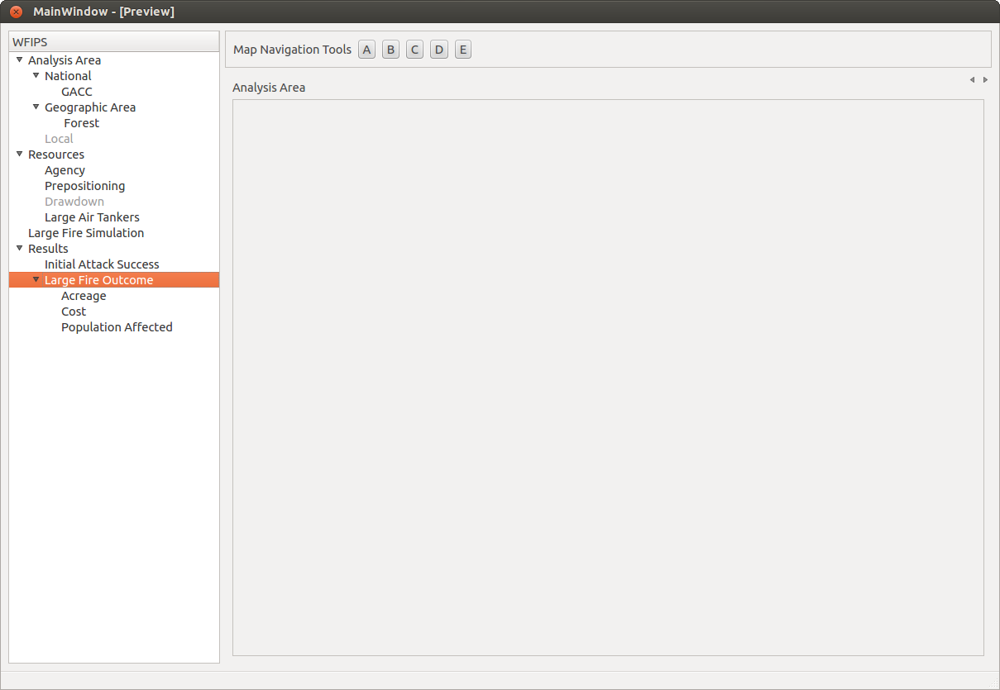

WFIPS Testing
=============

You have received this correspondence because you've been selected to help
design and test the WFIPS model.  WFIPS is a system that allows simulation of
initial attack and large fire outcomes across any scale in the Western U.S.
The system is being deployed on 'the cloud' to allow us to build transient,
high performance workstations.  Current USFS desktops do not have the
processing power to run simulations in a timely fashion.

Rackspace
---------

Rackspace is a prominent figure in cloud computing.  Currently, Kyle can create
and destroy machines on demand.  Each tester will have their own cloud based
server, and will be assigned an IP address for access.

The WFIPS project is charged for uptime for each of these servers.  That being
said, if a rough schedule can be provided to Kyle, he will destroy the servers
when the machines are not being used.

### Process for server management

0. Email, call or tell Kyle you'd like a server created.  It should take
less than an hour to get an IP and a user account from the base image.

0. Log into the IP address using `Remote Desktop Connection` on your
Microsoft Windows machine(`Start->Remote Desktop Connection`).

0. The username and password provided by Kyle.  You may change the password at
any time.

Running WFIPS
-------------

0. The WFIPS program will be located at: `C:/wfips/omffr_gui.exe` There will be
   a shortcut on your desktop to start the application.

0. Double click the shortcut and the program should start.

0. Navigate, break, abuse, etc.

### Data Requirements

WFIPS relies on a database called `omffr.sqlite` that may be located
in one of two places: `C:/wfips/data/` or
`C:/Users/ksshannon/Documents/Github/wfips/build/data/` Do not alter,
delete or mess with that file, it will render WFIPS essentially inoperable.

Testing Goals
-------------

The main goal for this testing cycle is to identify direction for the project.
Diane and Kyle have implemented core functionality of the system that allows
*quantifying the effectiveness of a resource configuration*.  We need to
know how the core users need to supply or edit those resource configurations.
Resource configurations include what type, how many, and where resources are
located.  If you'd like the system to arbitrarily handle some resource
configuration, we need to know how we *should* do that.  For example:

- Rick thinks the Okanogan forest has a few too many resources.
- Rick also thinks that the Willamette has too few.
- Rick wants to ask the program to randomly remove 10% of the resources from
  the Okanogan to the Willamette based on *some criteria*, e.g.
  *distribute my resources randomly within the Willamette according to the
  current resource distribution by type*, meaning if a location had 10% of
  the current allocation of engines, it will get 10% of the moved engines.

For the record, I just pulled those forests out of a hat, Kyle has no opinion
on either forest, nor the resource configuration for those forests.

Along with the work flow, we'd like to know how you would like to interface
with the program to get that task done.  Does it involve clicking on maps,
dragging things, etc.  We'd like to know the intuitive way to implement these
interactions.

When Something Goes Wrong
-------------------------

Things will go wrong.  The program will bring up a mysterious window that says
things like `std::exception()` or the little black console behind the
interface will say things like `Not a valid layer!`  When this
happens, it needs to be reported.  There are a few ways to handle this, but it
is in our best interest to keep communication open to limit noise and
duplication.  First off, you can contact Kyle:

    Kyle Shannon
    406-829-6954 (w)
    406-531-0510 (c)
    kyle at pobox dot com (sorry, don't want bots to read my email)

When Kyle replies, he may or may not cc the entire group of testers for
comment, clarification, etc.  You may send the initial email to the entire
group.

Kyle will also file a ticket on the WFIPS project managment site on GitHub.
Testers may or may not want to login to view the status of the issues.  Kyle is
keeping those for documentation sake, and status of the issues.  The link to
the issue database can be found
[here](https://github.com/firelab/wfips/issues).  An example issue can be found
[here](https://github.com/firelab/WFIPS/issues/1).  If you want to have access
to the ticketing/wiki system, you'll need a username/password for GitHub, and
I'll need to add you to the project.

New Interface Design
--------------------

After our meeting on 2014-10-02, it dawned on the developers that the interface,
as is, is too convoluted and complex.  There are too many permutations of
selections and not enough clarity on what has affect on what.  That being said,
Diane, Kyle, and Mark Finney had a quick discussion and decided that a more
well defined tree-based interface would be appropriate.

Each selection on the left will have a dedicated page on the right hand side
that may contain maps, selection/manipulation tools, or graphs and outputs.
More verbose documentation will be available through mouse hovering and other
means (online help eventually).

Known Issues
------------

### Windows limitations

Currently the windows based spatial extraction engine is *slow*.  We are
working on this, and it appears to be a bottleneck in file input/output in one
of the supporting libraries.  WFIPS can extract spatial data an order of
magnitude faster on Linux machines.

Technical Details
-----------------

WFIPS is heavily reliant on various open source applications including:

- [GDAL/OGR](http://gdal.org)
- [QGIS](http://qgis.org)
- [Spatialite](https://www.gaia-gis.it/fossil/libspatialite/index)
- [SQLite](http://sqlite.org)

Performance of various versions of these libraries may affect performance of
WFIPS in general.  See Known Issues for some more information.

Optional Linux Workstations
---------------------------

If any tester would like to try the linux flavor workstation, just make a
request to Kyle, he will generate one.  The process is nearly the same for the
tester, Kyle just has to add you as a user to a linux machine and fix some
permissions.

Cloned on GitHub
----------------

The most up-to-date version of this document is located
[here](https://github.com/firelab/wfips-doc/blob/master/testers/wfips_testing.md)

